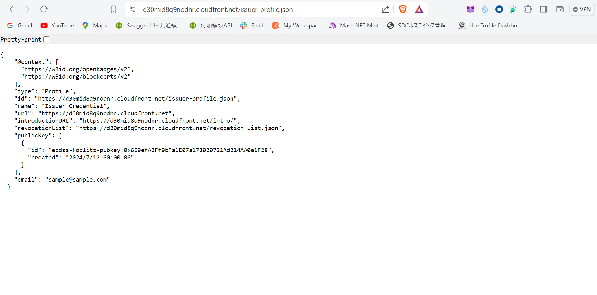

# 動かした記録

## 環境情報

```bash
node --version v20.11.0
npm --version 10.2.4
yarn --version 1.22.4
aws --version aws-cli/2.13.8 Python/3.11.4 Windows/10 exe/AMD64 prompt/off
cdk --version 2.148.1
docker --version Docker version 25.0.3, build 4debf41
```

docker も使える環境である必要あり。

## 準備したこと

- Alchemy で Sepolia の API エンドポイントを用意しました。
- faucet を取得しました。

## 動かした記録

- issuer の鍵ペアを生成

  ```bash
  yarn utils createWallet
  ```

  実行結果として`pkgs/utils/issuer.json`に鍵ペア情報が出力される。
  
  [作成したウォレットアドレス - 0x6E9efA2Ff9bFa1E07a173020721Ad214AA0e1F28](https://sepolia.etherscan.io/address/0x6E9efA2Ff9bFa1E07a173020721Ad214AA0e1F28)

- フロントエンドをビルドする。

  issuer 用、holder 用、verifier 用のフロントエンドをそれぞれビルドする。

  ```bash
  yarn holderwebapp build
  ```

  ```bash
  yarn issuerwebapp build
  ```

  ```bash
  yarn verifierwebapp build
  ```
  
- Lambdaで使う依存関係をインストールする

  ```bash
  yarn cdk lambdaInstall
  ```
  
- CDKで定義しているスタック一覧を確認する。

  ```bash
  yarn cdk stacklist
  ```
  
  ```bash
  DIDWafStack
  RemoteOutput
  DIDIssuerProfileBucketStack
  DIDIssuerProfileDestributionStack
  IssuerWebapp
  HolderWebapp
  VerifierWebapp
  ```

- CDK diff コマンドを実行する。

  展開されるリソースを確認する。

  ```bash
  yarn cdk diff
  ```
  
  以下のように出力されればOK!
  
  
  ```bash
  ✨  Number of stacks with differences: 7
  ```

- 環境変数の設定を行う。

  ```bash
  export SOURCE_IP_ADDRESS=18.119.6.208/32
  export ACCESS_FROM_REGION=US
  ```
  
- DIDIssuerProfileBucketStack をデプロイする。

  ```bash
  yarn cdk deploy DIDIssuerProfileBucketStack
  ```
  
  このスタックがデプロイされることで、IssuerProfileが公開される。
  
  ```bash
  Outputs:
  DIDIssuerProfileBucketStack.CloudFrontEndpoint = https://d30mid8q9nodnr.cloudfront.net
  DIDIssuerProfileBucketStack.ExportsOutputFnGetAttIssuerProfileBucket381855F4ArnA391C134 = arn:aws:s3:::didissuerprofilebucketsta-issuerprofilebucket38185-bwnqluqwchek
  DIDIssuerProfileBucketStack.ExportsOutputRefDistribution2A3FAFEFD8FF40E1A = E2LBME3QPMVBJ2
  DIDIssuerProfileBucketStack.ExportsOutputRefIssuerProfileBucket381855F47B4C3D0C = didissuerprofilebucketsta-issuerprofilebucket38185-bwnqluqwchek
  Stack ARN:
  arn:aws:cloudformation:us-east-1:966439519756:stack/DIDIssuerProfileBucketStack/e1c56640-4026-11ef-b6ee-0e85c0e81067
  
  ✨  Total time: 302.4s
  ```
  
- Issuer Profile と 失効した証明書を管理する Revocation List を作成する

  ```bash
  cp docs/issuerProfileTemplate/issuer-profile-template.json pkgs/cdk/issuerProfile/issuer-profile.json
  vi pkgs/cdk/issuerProfile/issuer-profile.json
  ```
  
  以下の内容で更新する。
  
  `qqqqqqqqqqqqqq`の部分には上記でデプロイした情報を埋め込む。
  
  ```json
  {
    "@context": [
      "https://w3id.org/openbadges/v2",
      "https://w3id.org/blockcerts/v2"
    ],
    "type": "Profile",
    "id": "https://d30mid8q9nodnr.cloudfront.net/issuer-profile.json",
    "name": "Issuer Credential",
    "url": "https://d30mid8q9nodnr.cloudfront.net",
    "introductionURL": "https://d30mid8q9nodnr.cloudfront.net",
    "revocationList": "https://d30mid8q9nodnr.cloudfront.net/revocation-list.json",
    "publicKey": [
      {
        "id": "ecdsa-koblitz-pubkey:0xd9bb04cf7147cbcdc03052df5da64af400d710b1",
        "created": "2017-06-29T14:48:03.814936+00:00"
      }
    ],
    "email": "example@example.com"
  }
  ```
  
  次に失効リストを管理するファイルをつくる。
  
  ```bash
  cp docs/issuerProfileTemplate/revocation-list-template.json pkgs/cdk/issuerProfile/revocation-list.json
  vi pkgs/cdk/issuerProfile/revocation-list.json
  ```
  
  `qqqqqqqqqqqqqq`の部分には上記でデプロイした情報を埋め込む。
  
  ```json
  {
    "@context": "https://w3id.org/openbadges/v2",
    "id": "https://d30mid8q9nodnr.cloudfront.net/revocation-list.json",
    "type": "RevocationList",
    "issuer": "https://d30mid8q9nodnr.cloudfront.net/issuer-profile.json",
    "revokedAssertions": []
  }
  ```

- Issuer Profileをデプロイする。

  ```bash
  yarn cdk deploy DIDIssuerProfileDestributionStack
  ```
  
  以下のURLでIssuer Profileが表示されるか確認する。
  
  [https://d30mid8q9nodnr.cloudfront.net/issuer-profile.json](https://d30mid8q9nodnr.cloudfront.net/issuer-profile.json)
  
  
  
  
  
- Alchemyのエンドポイントを指定する。

  ```bash
  export ETHEREUM_ENDPOINT=https://ETHEREUM_ENDPOINT
  ```
  
- issuerの秘密鍵とprofileのurlを環境変数に設定する  

  ```bash
  export ISSUER_PRIVATEKEY=0x.....
  export ISSUER_PROFILE_URL=https://d119t3sedo74h7.cloudfront.net/issuer-profile.json
  ```
  
- issuerの設定ファイルを編集する. 

  ```bash
  cp pkgs/cdk/lambda/python/Issue_vc/conf-template.ini pkgs/cdk/lambda/python/issue_vc/conf.ini 
  vi pkgs/cdk/lambda/python/issue_vc/conf.ini 
  ```
  
- `IssuerWebapp`スタックで使用するLambdaレイヤーを作成する。

  ```bash
  mkdir -p layer1/python
  ```
  
  ```bash
  mkdir -p layer2/python
  ```
  
  以下のコマンドをそれぞれ実行してインストール
  
  ```bash
  pip install -r pkgs/cdk/lambda/python/Issue_vc/layer1.txt -t layer1/python
  ```
  
  ```bash
  pip install -r pkgs/cdk/lambda/python/Issue_vc/layer2.txt -t layer2/python
  ```
  
  インストールが完了したら、zip化する。
  
  ```bash
  cd layer1 && zip -r ../layer1.zip .
  ```
  
  ```bash
  cd layer2 && zip -r ../layer2.zip .
  ```
  
  以下のコマンドでLambdaレイヤーとしてアップロードする。
  
  ```bash
  aws lambda publish-layer-version --layer-name AWS-Parameters-and-Secrets-Lambda-Extension-layer-1 --zip-file fileb://layer1.zip
  ```
  
  ```bash
  aws lambda publish-layer-version --layer-name AWS-Parameters-and-Secrets-Lambda-Extension-layer-2 --zip-file fileb://layer2.zip
  ```
  
- `IssuerWebapp`スタックをデプロイする

  ```bash
  yarn cdk deploy IssuerWebapp
  ```
  
  これでVerifiable Credentialを発行するためのWebAppがデプロイされる。
  
  ```bash
  Outputs:
  IssuerWebapp.DIDViewerEndpointForIssuer = https://d2tnmc3b2hc1ib.cloudfront.net
  IssuerWebapp.issuerWebAppApiEndpointForIssuerWebApp1780BCDF = https://3w1awxf66a.execute-api.us-east-1.amazonaws.com/prod/
  IssuerWebapp.issuerWebAppDIDIssuerApiEndpoint83F785EC = https://3w1awxf66a.execute-api.us-east-1.amazonaws.com/prod/
  IssuerWebapp.issuerWebAppSecretIssuerPrivateKeyArn5569A65C = arn:aws:secretsmanager:us-east-1:966439519756:secret:issuerWebAppSecretIssuerPri-NRAH1NDKtXsN-sCB5Yz
  IssuerWebapp.issuerWebAppUserPoolId623594C4 = us-east-1_4Y8dN7TRH
  IssuerWebapp.issuerWebAppUserPoolWEBClientIdForIssuerWebAppC5EF874B = 4ut2harb7tb0j9itqajm5f94np
  Stack ARN:
  arn:aws:cloudformation:us-east-1:966439519756:stack/IssuerWebapp/f6d72fc0-4335-11ef-bdb0-0affec3bb6d7
  
  ✨  Total time: 488.83s
  ```
  
- 環境変数を更新する。

  `pkgs/issuewebapp`配下に`.env.local`ファイルを作成して以下の環境変数を設定する。
  
  ```txt
  VUE_APP_AWS_REGION=ap-northeast-1
  VUE_APP_API_ENDPOINT=
  VUE_APP_USER_POOL_ID=
  VUE_APP_USER_POOL_WEB_CLIENT_ID=
  ```
  
- 再び`issuewebapp`をビルドして変更分をスタックに適用させる。

  ```bash
  yarn issuerwebapp build
  ```
  
- 再び`IssuerWebapp`スタックをデプロイする。

  ```bash
  yarn cdk deploy IssuerWebapp
  ```
  
- `HolderWebapp`スタックをデプロイする。

  ```bash
  yarn cdk deploy HolderWebapp
  ```
  
  ```bash
  Outputs:
  HolderWebapp.DIDViewerEndpointForHolder = https://d22827okd70ih7.cloudfront.net
  HolderWebapp.holderwebappApiEndpointForHolderWebAppB450BBC3 = https://kqyukapsbd.execute-api.us-east-1.amazonaws.com/prod/
  HolderWebapp.holderwebappDIDHolderApiEndpoint7623539F = https://kqyukapsbd.execute-api.us-east-1.amazonaws.com/prod/
  HolderWebapp.holderwebappHolderVcBucketName729D006D = 966439519756-holder-vc-bucket
  HolderWebapp.holderwebappUserPoolIdForHolderWebAppFAD87864 = us-east-1_F9xhfr6vW
  HolderWebapp.holderwebappUserPoolWEBClientIdForHolderWebApp84043482 = 8kro5pfc2bmg3de9k347r2vrk
  Stack ARN:
  arn:aws:cloudformation:us-east-1:966439519756:stack/HolderWebapp/c2309b90-4343-11ef-b6f5-12cf44e55361
  
  ✨  Total time: 433.02s
  
  
  Done in 466.25s.
  ```

- 環境変数を更新する。

  `pkgs/holderwebapp`配下に`.env.local`ファイルを作成して以下の環境変数を設定する。
  
  ```txt
  VUE_APP_AWS_REGION=ap-northeast-1
  VUE_APP_API_ENDPOINT=
  VUE_APP_USER_POOL_ID=
  VUE_APP_USER_POOL_WEB_CLIENT_ID=
  ```
  
- 再び`holderwebapp`をビルドして変更分をスタックに適用させる。

  ```bash
  yarn holderwebapp build
  ```
  
- 再び`HolderWebapp`スタックをデプロイする。

  ```bash
  yarn cdk deploy HolderWebapp
  ```
  
- `VerifierWebapp`スタックをデプロイする。

  ```bash
  yarn cdk deploy VerifierWebapp
  ```
  
  ```bash
  Outputs:
  VerifierWebapp.DIDViewerEndpointForVerifier = https://dxga6v0d5hbby.cloudfront.net
  VerifierWebapp.verifyWebAppApiEndpointForVerifierWebAppC1DA95B7 = https://u349ixyamc.execute-api.us-east-1.amazonaws.com/prod/
  VerifierWebapp.verifyWebAppDIDVerifierApiEndpoint89CED720 = https://u349ixyamc.execute-api.us-east-1.amazonaws.com/prod/
  VerifierWebapp.verifyWebAppUserPoolIdForVerifierWebAppF61B957F = us-east-1_QQhzJFopY
  VerifierWebapp.verifyWebAppUserPoolWEBClientIdForVerifierWebAppAD150E68 = 3q299aer2uejcpjr5qkfj1ipi6
  Stack ARN:
  arn:aws:cloudformation:us-east-1:966439519756:stack/VerifierWebapp/b77ff4d0-4347-11ef-9b1e-0e4c48c4ca71
  
  ✨  Total time: 452.85s
  
  
  Done in 482.66s.
  ```
  
- 環境変数を更新する。

  `pkgs/verifierwebapp`配下に`.env.local`ファイルを作成して以下の環境変数を設定する。
  
  ```txt
  VUE_APP_AWS_REGION=ap-northeast-1
  VUE_APP_API_ENDPOINT=
  VUE_APP_USER_POOL_ID=
  VUE_APP_USER_POOL_WEB_CLIENT_ID=
  ```
  
- 再び`verifierwebapp`をビルドして変更分をスタックに適用させる。

  ```bash
  yarn verifierwebapp build
  ```
  
- 再び`VerifierWebapp`スタックをデプロイする。

  ```bash
  yarn cdk deploy VerifierWebapp
  ```
  
- デプロイしたフロントエンドにそれぞれアクセスしてVerifiable Credentialを発行・検証できるかテストする。

    [HolderWebApp](https://d22827okd70ih7.cloudfront.net)
    
    [IssuerWebApp](https://d2tnmc3b2hc1ib.cloudfront.net)
    
    [VerifierWebApp](https://dxga6v0d5hbby.cloudfront.net)